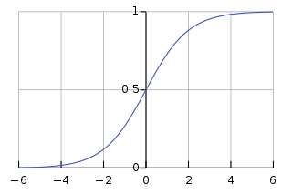
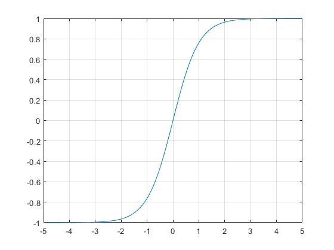

# 일일 회고 (2023-11-10)

## 일일 진도 현황
- 완강! 심화문제를 풀어야합니다

## 궁금한 점
- ### sigmoid와 tanh
  강의 내용에 sigmoid와 tanh 그래프를 보여주는데 그래프의 모양을 보면 둘이 매우 유사합니다.  
  이 둘의 사용할 때 어떤 차이점이 있는지 찾아 보았습니다.  
  
    
  sigmoid보다 tanh가 더 좋은 이유가 2가지 있습니다.  

  - #### sigmod와 tanh의 기울기  
    sigmoid보다 tanh의 기울기가 더 큽니다.  
    기울기가 크면 W와 b를 더 빨리 업데이트할 수 있습니다.
    sigmoid 공식은 :  
    $$\sigma(x) = \frac{e^x}{1 + e^x}$$  
    tanh 공식은 :  
    $$tanh \left( x \right) = 2 \cdot \sigma \left( 2 x \right) - 1$$  
    tanh 공식을 잘보면 sigmoid를 사용하고 있고,
    sigmoid에 2를 곱하고 1을 빼서 (-1,1)을 가지고 sigmoid의 입력에 2를 곱하여 기울기가 더 크다는 것을 확인할 수 있습니다.

        
  - #### 기울기 편향
    sigmoid는 (0,1)의 범위를 가지고 있고 tanh는 (-1,1)범위를 가집니다.  
    입력이 모두 양수라고 가정하면 sigmoid는 양의 방향의 값만 출력합니다. 이렇게 되면 sigmoid를 사용하여 역전파할 때 모두 한 방향으로 편향될수 있는 단점이 있습니다.  

- ### 표본표준편차
    표본표준편차 공식을 잘 몰라서 틀렸습니다... 다시 공부하겠습니당
        
  
## 참고자료
- https://leeejihyun.tistory.com/32
- https://stats.stackexchange.com/questions/101560/tanh-activation-function-vs-sigmoid-activation-function

## 계획
- 강의 마무리 후 복습 혹은 수학 공부.
